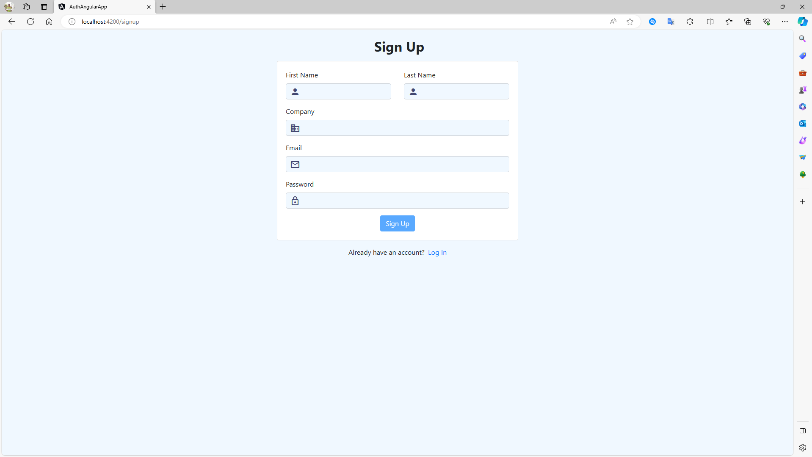

# Angular JWT Authentication System

## Screenshots

<div align="center">
  
  
</div>

## Overview

This project is an Angular-based authentication system using JSON Web Tokens (JWT). It provides a robust and secure way of handling user authentication in Angular applications.

## Features

- **User Registration**: Allows new users to create an account.
- **User Login**: Enables users to log in to the application.
- **Authenticated User Data Retrieval**: Displays data of the authenticated user.
- **Toasts for Notifications**: Uses a toaster component for displaying messages.
- **Reactive Forms**: Utilizes Angular Reactive Forms for handling form inputs.
- **Bootstrap Styling**: Styled with Bootstrap for a responsive and modern UI.
- **HTTP Interceptor**: Includes an interceptor to add `withCredentials` to all backend requests.

## Getting Started

### Prerequisites

- Node.js
- Angular CLI

## Installation

1. **Clone the repository**:
   ```bash
   git clone https://github.com/dev-ambinintsoa/angular-jwt-authentication-system.git
   ```

2. **Navigate to the project directory**:
   ```bash
   cd angular-jwt-authentication-system
   ```

3. **Install dependencies**:
   ```bash
   npm install
   ```

4. **Run the application**:
   ```bash
   ng serve
   ```

5. **Open your browser** and navigate to `http://localhost:4200`.

## Usage

### Registration

1. Navigate to the **Registration** page.
2. Fill in the required fields.
3. Submit the form to create a new user account.

### Login

1. Navigate to the **Login** page.
2. Enter your credentials.
3. Submit the form to log in.

### Viewing Authenticated User Data

- Once logged in, navigate to the **Authenticated User** component to view your data.

## Contact

For any queries or contributions, feel free to connect with me:

- [](mailto:ambinintsoa.business@gmail.com)
- [](https://linkedin.com/in/ambinintsoa-zo/)

## Acknowledgments

- Angular Team for the amazing framework.
- Bootstrap for the UI components.
- Community contributors and everyone who supports this project.
